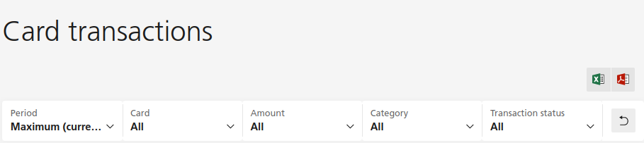

# UBS Regexp Transaction Reader



This repo is a small project to filter out UBS credit card transactions.
Because this feature is not available on the website, this repo is a little
script to filter out transactions by regexp and start/end dates, showing
you your total.

To run, simply do the following to get all transactions that match the
regexp `SBB` or `CFF` for example:

```python
python read_tx.py --regexp 'SBB|CFF'
```

All list of functions are here:

```
usage: read_tx.py [-h] --regexp REGEXP [--start_date START_DATE]
                  [--end_date END_DATE] [--delimiter DELIMITER] [--path PATH]
                  [--print_individual_transactions]

UBS Transactions

options:
  -h, --help            show this help message and exit
  --regexp REGEXP       The regexp to match on
  --start_date START_DATE
                        Consider dates only after this date. Must be of the form
                        DD.MM.YYYY
  --end_date END_DATE   Consider dates only before this date. Must be of the form
                        DD.MM.YYYY
  --delimiter DELIMITER
                        The delimiter to use to read the CSV
  --path PATH           The path to the CSV
  --print_individual_transactions
                        Whether to print individual transactions
```
